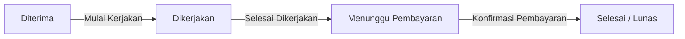
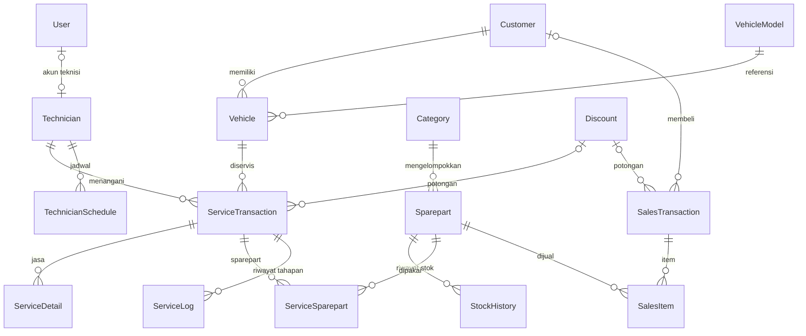

# Garage Management — Aplikasi Manajemen Bengkel

Digitalisasi operasional bengkel: **pelanggan, kendaraan, service, sparepart, penjualan, teknisi, dan laporan keuangan** dalam satu aplikasi web.

    

## Daftar Isi

1. [Ringkasan Produk](#1-ringkasan-produk)
2. [Ruang Lingkup](#2-ruang-lingkup)
3. [Detail Fitur per Modul](#3-detail-fitur-per-modul)
4. [Kebutuhan Nonfungsional](#4-kebutuhan-nonfungsional)
5. [Arsitektur Sistem](#5-arsitektur-sistem)
6. [Instalasi & Menjalankan](#6-instalasi--menjalankan)
7. [Alur Pengguna](#7-alur-pengguna)
8. [Risiko dan Mitigasi](#8-risiko-dan-mitigasi)
9. [Skema Database](#9-skema-database)
10. [Troubleshooting](#10-troubleshooting)

---

## 1. Ringkasan Produk

### 1.1 Tujuan Produk

Menggantikan pencatatan manual (kertas/spreadsheet) dengan satu database terpusat:

- **Data terpusat** — pelanggan, kendaraan, dan riwayat service dalam satu tempat.
- **Hitung otomatis** — subtotal, diskon, pajak, dan kembalian; server menghitung ulang sebelum data disimpan.
- **Stok otomatis** — terpotong saat sparepart dipakai (service/penjualan), dikembalikan bila transaksi diubah atau dihapus, lengkap dengan riwayat stok masuk/keluar.
- **Pelacakan teknisi** — jadwal, riwayat, dan statistik service yang ditangani.
- **Dokumen instan** — Bukti Service Diterima, Tagihan, Invoice, Struk Thermal, dan Work Order, termasuk cetak langsung ke printer thermal.
- **Service 4 tahap** — Diterima → Dikerjakan → Menunggu Pembayaran → Selesai (Lunas), dengan riwayat tahapan tercatat otomatis.
- **Laporan periodik** — stok, layanan service, dan penjualan untuk pengambilan keputusan.

### 1.2 Sasaran Pengguna

| Role | Deskripsi | Kebutuhan Utama |
|---|---|---|
| **Admin** | Pemilik/pengelola bengkel | Akses penuh: laporan, pengaturan aplikasi, diskon, manajemen user, hapus transaksi lunas |
| **Staff** | Kasir / front office | Input pelanggan, kendaraan, transaksi service & penjualan, lihat laporan |
| **Teknisi** | Mekanik pelaksana | Melihat service yang ditugaskan, mengisi pengerjaan (KM, jasa, sparepart), menandai selesai dikerjakan |

---

## 2. Ruang Lingkup

### 2.1 Fitur Utama

1. **Dashboard** — total pelanggan, kendaraan, service, pendapatan service (lunas), pendapatan sales, estimasi laba penjualan, alert stok menipis/habis, dan service terbaru (filter Hari/Minggu/Bulan Ini).
2. **Pelanggan** — CRUD, validasi email & No. HP, detail dengan daftar kendaraan & riwayat service, aksi cepat Tambah Kendaraan / Buat Service / Buat Penjualan.
3. **Sparepart** — CRUD kategori & sparepart, pemindaian barcode, Stok Masuk/Keluar manual, dan Riwayat Stok (sumber: Manual/Service/Penjualan).
4. **Kendaraan** — Data Master (merk/model/tahun/tipe/roda) dan Data Kendaraan milik pelanggan beserta riwayat service.
5. **Layanan** — Jenis Layanan (master jasa) dan Data Layanan (transaksi service 4 tahap) dengan Panggil ke Kasir, Kirim WhatsApp, dan cetak dokumen.
6. **Penjualan** — jual sparepart retail (pelanggan terdaftar/umum), diskon, pajak, kembalian, cetak Invoice/Struk, Kirim WhatsApp.
7. **Teknisi** — CRUD, status Aktif/Nonaktif, jadwal, riwayat & statistik; akun Teknisi ditautkan ke data teknisi.
8. **Users** — manajemen akun, role, tautan teknisi, reset password.
9. **Laporan** — Layanan, Penjualan, dan Stok per periode/kategori; cetak atau simpan PDF.
10. **Admin** — Pengaturan Aplikasi (identitas, logo, printer thermal, pajak) dan CRUD Diskon/Kupon.

### 2.2 Di Luar Scope (MVP)

- Payment gateway / pembayaran online (pembayaran dicatat manual oleh kasir).
- Notifikasi otomatis SMS/WhatsApp/Email — pesan WhatsApp hanya disiapkan lalu dikirim manual lewat tautan `wa.me`.
- Aplikasi mobile native (versi awal web responsif).
- Multi-cabang / multi-tenant.
- Booking/reservasi service online oleh pelanggan.
- Integrasi akuntansi pihak ketiga.
- Laporan analitik lanjutan (BI/grafik kompleks).
- Backup & restore dari dalam aplikasi (lakukan manual di luar aplikasi, mis. `pg_dump`).

### 2.3 Struktur Menu & Hak Akses

Menu **Dashboard, Pelanggan, Penjualan, Teknisi, dan Users** berupa link langsung; menu lainnya (Sparepart, Kendaraan, Layanan, Laporan, Admin) berupa dropdown. Tambah/edit data dibuka sebagai halaman tersendiri (bukan popup).

| Menu | Submenu / Isi | Admin | Staff | Teknisi |
|---|---|:-:|:-:|:-:|
| Dashboard | Ringkasan metrik, alert stok, service terbaru | ✅ | ✅ | – |
| Pelanggan | Data, Detail, Form Tambah/Edit | ✅ | ✅ | – |
| Sparepart | Data Sparepart, Kategori, Riwayat Stok | ✅ | ✅ | – |
| Kendaraan | Data Kendaraan, Master Kendaraan | ✅ | ✅ | – |
| Layanan | Data Layanan, Jenis Layanan | ✅ | ✅ | ✅ *(hanya service miliknya)* |
| Penjualan | Data Penjualan, Tambah, Detail/Invoice | ✅ | ✅ | – |
| Teknisi | Data Teknisi, Jadwal, Riwayat & Statistik | ✅ | ✅ | – |
| Laporan | Layanan, Penjualan, Stok | ✅ | ✅ | – |
| Users | Pengguna & Hak Akses | ✅ | – | – |
| Admin | Pengaturan Aplikasi & Diskon | ✅ | – | – |

**Aturan Teknisi:** hanya bisa membuka menu Layanan dan hanya melihat service yang ditugaskan kepadanya (dibatasi di **server** berdasarkan tautan akun ke data teknisi). Saat status *Dikerjakan*, teknisi mengisi KM, jasa, sparepart, rekomendasi, dan catatan internal, lalu menandai selesai dikerjakan. Memulai pengerjaan, mengubah tagihan, pembayaran, edit, dan hapus hanya untuk Admin/Staff. Setelah login, Teknisi langsung diarahkan ke Data Layanan.

> Agar akun Teknisi terbatas pada service miliknya, tautkan lewat **Users → Tautkan ke Data Teknisi**.

---

## 3. Detail Fitur per Modul

### 3.1 Pelanggan

- Data: nama (wajib), No. HP (wajib), email & alamat (opsional); validasi format email dan No. HP.
- Daftar dengan pencarian dan aksi Lihat/Edit/Hapus.
- Detail menampilkan kendaraan milik pelanggan, riwayat service, dan aksi cepat Tambah Kendaraan / Buat Service / Buat Penjualan.

### 3.2 Kendaraan

- **Data Master** — referensi Merk, Model, Tahun, Tipe (MPV/SUV/Hatchback), dan Jumlah Roda; menjadi acuan pilihan agar tidak ada duplikasi input.
- **Data Kendaraan** — pilih Pemilik dan Jenis Kendaraan, isi No. Plat (wajib, unik), VIN, No. Mesin, Warna, Tahun Pembelian, Catatan.
- Detail menampilkan info kendaraan, info pemilik, dan seluruh riwayat service; dari sini staff dapat langsung membuat service baru.

### 3.3 Sparepart & Stok

- Buat **Kategori** dahulu, lalu **Sparepart**: kode (unik, bisa scan barcode), nama, kategori, harga beli/jual, stok awal, batas stok rendah (bawaan 5).
- **Stok Masuk / Keluar** manual dengan keterangan; stok keluar tidak boleh melebihi stok tersedia. Semua tercatat di Riwayat Stok.
- Stok berkurang otomatis saat dipakai di Service (saat pengerjaan disimpan) atau Penjualan; dikembalikan otomatis bila pemakaian diubah atau transaksi dihapus.
- Status stok: **Baik**, **Rendah** (≤ batas per item), **Habis** (0) — tampil sebagai alert di Dashboard.
- Pencarian sparepart (daftar dan form service/penjualan) mendukung scan barcode lewat kamera.

### 3.4 Layanan (Service Kendaraan)

Status: `DITERIMA` → `DIKERJAKAN` → `MENUNGGU_PEMBAYARAN` → `SELESAI` (Lunas). Rincian alurnya ada di [bagian 7.2](#72-alur-transaksi-service).

| Tahap | Isi | Aksi |
|---|---|---|
| **1. Diterima** | Kendaraan (pemilik & No. WhatsApp terisi otomatis), Teknisi, Tanggal, Keluhan. Nomor `SVC-TTTTBBHH-0001` dibuat otomatis | Kirim WA, Cetak Bukti Diterima, Mulai Kerjakan, Edit, Hapus |
| **2. Dikerjakan** | KM (wajib), Detail Jasa (pilih Jenis Layanan atau manual, multi-jasa), Sparepart, Rekomendasi & Tanggal Service Berikutnya, Catatan Internal | Simpan Pekerjaan (stok terpotong), Selesai Dikerjakan |
| **3. Menunggu Pembayaran** | Rincian dapat diubah, pilih Diskon, ringkasan Subtotal → Diskon → Pajak → Total | Panggil ke Kasir, Cetak Tagihan, Kirim WA |
| **4. Selesai (Lunas)** | Jumlah Dibayar & Kembalian; transaksi terkunci (hanya-lihat) | Cetak Invoice / Struk Thermal / Work Order, Kirim WA |

**Validasi**

- Tahap 1: Kendaraan, Teknisi, Tanggal, Keluhan wajib.
- Selesai Dikerjakan: KM tersimpan dan minimal 1 jasa.
- Pembayaran hanya saat *Menunggu Pembayaran*, dan Jumlah Dibayar ≥ Total.
- Edit hanya untuk Admin/Staff selama belum lunas. Hapus: Admin/Staff; transaksi lunas hanya **Admin**. Stok yang terpakai dikembalikan otomatis dan dicatat di Riwayat Stok.
- Catatan Internal **tidak** tampil di dokumen cetak maupun pesan WhatsApp.
- Setiap perpindahan tahap tercatat di **Riwayat Tahapan** (`ServiceLog`: tahap, keterangan, pelaksana, waktu).

**Panggil ke Kasir** — pada tahap Menunggu Pembayaran, browser mengucapkan (Web Speech API):

> "Perhatian. Atas nama *[nama pelanggan]*, dengan nomor polisi *[plat, dieja per karakter]*, sudah selesai pengerjaan. Silakan ke kasir untuk melakukan pembayaran."

Kalimat dapat diubah di `frontend/src/utils/tts.js` (fungsi `buildCashierCallText`).

### 3.5 Penjualan Sparepart (Retail)

1. Nomor Invoice `SLS-TTTTBBHH-0001` dan tanggal dibuat otomatis saat halaman Tambah Penjualan dibuka.
2. Pilih **Pelanggan Terdaftar** atau **Pelanggan Umum** (walk-in, nama bawaan "Pelanggan Umum").
3. Tambah item sparepart (cari/scan); jumlah tidak boleh melebihi stok, subtotal per item dihitung otomatis, item bisa dihapus sebelum disimpan.
4. Pilih Diskon/Kupon aktif (opsional). Perhitungan: Subtotal → Diskon → Tax Sales → Total.
5. Isi Jumlah Dibayar (≥ Total), kembalian dihitung otomatis.
6. Simpan dalam satu transaksi database: potong stok dan catat Riwayat Stok.
7. Halaman Detail menampilkan Invoice; tersedia Kirim WA (pelanggan terdaftar ber-HP), cetak Invoice, dan Struk Thermal.
8. Hapus transaksi hanya **Admin**; stok dikembalikan otomatis dan dicatat.

### 3.6 Teknisi

- CRUD: nama, keahlian (teks bebas), status Aktif/Tidak Aktif (Tidak Aktif tidak muncul di pilihan Tambah Service).
- Detail: Jadwal (tambah/ubah/hapus manual), Riwayat Service, dan Statistik (total service, jumlah jadwal).
- Akun role Teknisi ditautkan ke satu data teknisi — tautan inilah yang membatasi akses.

### 3.7 Users & Admin

- **Users** (Admin): username, email, role, tautan teknisi, password (bcrypt, minimal 8 karakter), reset password.
- **Pengaturan Aplikasi** (Admin): nama/alamat/telepon bengkel, logo (PNG/JPG/WEBP/GIF, maks. 2 MB), ukuran kertas (58/80 mm), cara cetak thermal, pajak Service & Sales, dan **Tes Cetak**.
- **Diskon** (Admin; Staff hanya memilih): nama, kode kupon (opsional, unik), tipe (Percentage/Nominal), nilai, status, dan cakupan (Semua/Service/Sparepart).

### 3.8 Laporan

| Laporan | Filter | Ringkasan |
|---|---|---|
| Stok | Kategori | Total sparepart, baik/rendah/habis, nilai total stok, detail per sparepart |
| Layanan Service | Tanggal mulai–akhir | Jumlah service, total biaya, selesai vs berjalan, detail transaksi |
| Penjualan | Tanggal | Total penjualan, total laba, jumlah transaksi & item, detail transaksi |

Semua laporan dapat dicetak atau disimpan sebagai PDF lewat dialog cetak browser.

### 3.9 Pencetakan & Printer Thermal

Dokumen: Bukti Service Diterima, Tagihan, Invoice Service, Struk Thermal, Work Order, Invoice & Struk Penjualan, serta laporan. Struk dibentuk sebagai perintah **ESC/POS** (32 kolom untuk 58 mm, 48 kolom untuk 80 mm).

Atur di **Admin → Pengaturan Aplikasi**, lalu tekan **Tes Cetak**:

| Mode | Cara kerja | Cocok untuk |
|---|---|---|
| Dialog cetak browser *(bawaan)* | `window.print()` lewat driver | Cadangan / tanpa setup |
| Printer di komputer server (RAW) | Backend mengirim byte ke antrean printer OS | Printer USB di Windows |
| Printer jaringan (IP:9100) | Backend membuka koneksi TCP ke printer | Printer LAN/WiFi |
| USB langsung (WebUSB) | Browser bicara langsung ke printer | Chrome/Edge |
| Serial / Bluetooth COM (Web Serial) | Browser menulis ke port COM | Printer Bluetooth/USB-serial |

- Printer Bluetooth: *pair* di sistem operasi sehingga muncul sebagai port COM, lalu pilih dari Chrome/Edge. Pilihan tersimpan di browser perangkat tersebut.
- Mode RAW dan jaringan dikirim lewat `/api/print/raw` (Admin/Staff); tujuan printer **selalu diambil dari Pengaturan**, bukan dari request, sehingga endpoint tidak bisa dipakai mengirim data ke alamat sembarang.
- RAW dan jaringan membutuhkan backend yang satu komputer/jaringan dengan printer — tidak berfungsi bila backend di cloud.
- WebUSB/Web Serial hanya di Chrome/Edge dan hanya lewat `localhost` atau `https`.
- Jika pengiriman gagal, tampil pesan kesalahan berbahasa Indonesia dan otomatis beralih ke dialog cetak browser.

---

## 4. Kebutuhan Nonfungsional

**Keamanan**

- JWT: access token 15 menit + refresh token 7 hari, diperbarui otomatis oleh interceptor Axios. Password di-hash dengan bcrypt (`bcryptjs`).
- RBAC di middleware Express (`authenticate` + `authorize`) pada setiap endpoint; Teknisi dibatasi ke service miliknya. React menambah proteksi route per role.
- Validasi di client dan server (format email/HP, stok, jumlah dibayar); Prisma Client (query berparameter) mencegah SQL Injection.
- Upload logo divalidasi tipe & ukuran maks. 2 MB (Multer).
- Secret JWT dan koneksi database di `.env`; CORS dibatasi ke `CLIENT_URL`.

**Performa**

- Respons API rata-rata < 1 detik untuk CRUD standar.
- Total dihitung instan di client, divalidasi ulang di server.
- Index database (`@@index`) pada kolom yang sering difilter (kode, tanggal, status, no. plat, kategori).

**Kompatibilitas & Usability**

- Responsif (desktop, tablet, mobile) dengan Tailwind CSS.
- Browser modern (Chrome, Firefox, Edge, Safari); cetak langsung WebUSB/Web Serial hanya Chrome/Edge.
- Kode modular: backend (`routes`, `controllers`, `middleware`, `utils`) dan frontend (`pages` per fitur, `components/ui`, `context`, `hooks`, `utils`).
- Antarmuka dan pesan kesalahan berbahasa Indonesia.

---

## 5. Arsitektur Sistem

Web application: **SPA React + Vite** mengonsumsi **REST API Express.js**, dengan **Prisma ORM** ke **PostgreSQL** native (tanpa Docker).

| Layer | Teknologi | Fungsi |
|---|---|---|
| Front-end | React 18, Vite 5, React Router 6, Tailwind CSS 3, Axios, react-icons, `@zxing/browser` | SPA top bar berbasis role, `ProtectedRoute`, pemindai barcode, Panggil ke Kasir (Web Speech API) |
| Back-end | Node.js, Express 4, cors, morgan, dotenv, Multer, express-validator | REST API port 4000: routes → middleware → controllers → utils; logika bisnis dan error handler terpusat |
| ORM | Prisma 5 | Pemetaan model, migrasi, seed, dan operasi atomik via `prisma.$transaction()` |
| Database | PostgreSQL 14+ | Seluruh data aplikasi, dengan index pada kolom yang sering difilter |
| Autentikasi | JWT, bcryptjs, interceptor Axios | `/auth/login`, `/auth/refresh`, `/auth/me`; token sebagai Bearer |
| File Storage | Disk lokal `backend/uploads` + Multer | Logo bengkel, disajikan statis di `/uploads` (DB hanya menyimpan `logoUrl`) |
| Cetak | ESC/POS, WebUSB, Web Serial, TCP 9100, spooler OS | Struk thermal ke USB, Bluetooth, jaringan, atau printer server |
| Integrasi | Tautan WhatsApp (`wa.me`), Web Speech API | Pesan disiapkan backend lalu dikirim manual oleh staff |

**API** — REST JSON di `/api/*` (base URL dari `VITE_API_URL`), 16 grup endpoint: `auth`, `users`, `customers`, `vehicle-models`, `vehicles`, `categories`, `spareparts`, `technicians`, `service-types`, `services`, `sales`, `discounts`, `settings`, `print`, `reports`, `dashboard`, ditambah `/api/health`. Error dikembalikan sebagai `{ "message": "..." }`.

**Alur komunikasi:** React → (Axios + Bearer JWT) → Express memvalidasi token & role, memeriksa payload, menjalankan logika bisnis, menghitung ulang total → Prisma → PostgreSQL. Bila access token kedaluwarsa, interceptor meminta token baru dengan refresh token lalu mengulang request. Operasi multi-tabel (simpan pengerjaan + potong stok + riwayat stok, simpan penjualan, hapus transaksi) dibungkus `prisma.$transaction()` agar atomik.

**Struktur proyek**

```
bengkel-app/
├── backend/      # Express + Prisma API
│   ├── prisma/   #   schema, migrasi, seed
│   └── src/      #   routes, controllers, middleware, utils
├── frontend/     # React + Vite SPA
│   └── src/      #   pages, components/ui, context, hooks, utils
├── database/     # garage_management.sql (struktur + data awal)
└── docs/         # Panduan instalasi, menjalankan, dan deploy
```

---

## 6. Instalasi & Menjalankan

Prasyarat: **Node.js 18+** dan **PostgreSQL 14+**.

| Dokumen | Isi |
|---|---|
| [docs/INSTALASI.md](docs/INSTALASI.md) | Instalasi Node.js, PostgreSQL, backend, frontend, database |
| [docs/MENJALANKAN.md](docs/MENJALANKAN.md) | Menjalankan aplikasi (development & produksi lokal) |
| [docs/DEPLOY.md](docs/DEPLOY.md) | Deploy ke VPS Ubuntu + Nginx + PM2, serta opsi Vercel/Render |
| [database/garage_management.sql](database/garage_management.sql) | File database: struktur tabel + data awal |

### Mulai Cepat

```bash
# 1. Buat database (di psql)
CREATE USER bengkel_user WITH PASSWORD 'bengkel_pass';
CREATE DATABASE bengkel_db OWNER bengkel_user;

# 2. Backend
cd backend
cp .env.example .env          # Windows PowerShell: copy .env.example .env
npm install
npm run prisma:deploy         # membuat semua tabel
npm run seed                  # data awal + akun demo
npm run dev                   # http://localhost:4000

# 3. Frontend (terminal baru)
cd frontend
cp .env.example .env
npm install
npm run dev                   # http://localhost:5173
```

Alternatif untuk `prisma:deploy` + `seed`: impor `database/garage_management.sql` (lihat [Opsi B — Impor File SQL](docs/INSTALASI.md#opsi-b--impor-file-sql)).

**Data contoh lengkap** (200 sparepart, 14 kategori, 66 jenis layanan, 83 master kendaraan, 8 teknisi, 25 pelanggan + 29 kendaraan, 8 diskon) ada di `backend/prisma/seed-data/`:

```bash
npm run seed          # isi/perbarui data (aman diulang, tidak menggandakan data)
npm run seed:reset    # HAPUS data master & transaksi lama dulu, lalu isi ulang (user & pengaturan tetap)
```

Tanpa Node/Prisma? Impor `database/data_master.sql` setelah struktur tabel dibuat (dibuat otomatis dari data yang sama lewat `node backend/prisma/export-sql.js`).

### Variabel Lingkungan Penting

| File | Variabel | Keterangan |
|---|---|---|
| `backend/.env` | `DATABASE_URL` | Koneksi PostgreSQL |
| | `JWT_ACCESS_SECRET`, `JWT_REFRESH_SECRET` | Secret acak yang kuat |
| | `CLIENT_URL` | URL frontend untuk CORS (tanpa `/` di akhir) |
| | `PORT`, `UPLOAD_DIR` | Port API dan folder upload |
| `frontend/.env` | `VITE_API_URL` | Base URL API, mis. `http://localhost:4000/api` |

### Akun Demo

| Username | Password | Role |
|---|---|---|
| admin | admin123 | ADMIN |
| staff | staff123 | STAFF |
| teknisi1 | teknisi123 | TEKNISI |

> ⚠️ Ganti password akun demo dan isi secret JWT yang kuat sebelum dipakai di produksi.

---

## 7. Alur Pengguna

### 7.1 Alur Login

1. User membuka halaman Login, input username/email dan password.
2. Express memvalidasi kredensial (bcrypt compare); bila valid, menerbitkan access & refresh token (JWT berisi `id`, `username`, `role`, `technicianId`).
3. React menyimpan token lalu mengarahkan: **Admin/Staff → Dashboard**, **Teknisi → Data Layanan** (hanya service miliknya).

### 7.2 Alur Transaksi Service



1. Staff pilih/buat **Pelanggan** → tambahkan **Kendaraan** bila belum ada.
2. **Tambah Service**: pilih kendaraan (pemilik & No. WA otomatis), teknisi, tanggal, keluhan → Simpan.
3. Status **Diterima** → Detail Transaksi dengan aksi Kirim WA, Cetak Service Diterima, Mulai Kerjakan, Edit, Hapus.
4. **Mulai Kerjakan** → status **Dikerjakan** → isi KM, jasa, sparepart, rekomendasi & tanggalnya, catatan internal → **Simpan Pekerjaan** (stok terpotong, subtotal dihitung).
5. **Selesai Dikerjakan** (validasi KM + minimal 1 jasa) → status **Menunggu Pembayaran** → halaman Tagihan: periksa/ubah rincian, pilih diskon → Total = setelah Diskon + Pajak. Tersedia Panggil ke Kasir, Cetak Tagihan, Kirim WA.
6. Kasir input **Jumlah Dibayar** → kembalian dihitung → **Konfirmasi Pembayaran** → status **Selesai (Lunas)**, Riwayat Tahapan tercatat.
7. Halaman detail hanya-lihat → Cetak Invoice / Struk Thermal / Work Order dan Kirim WA.

### 7.3 Alur Transaksi Penjualan

1. Staff pilih Pelanggan Terdaftar/Umum → tambah item sparepart & jumlah (cari atau scan barcode).
2. Sistem hitung Subtotal → Diskon → Pajak → Total; input dibayar → hitung kembalian.
3. Simpan → Prisma transaction: insert `SalesTransaction` + `SalesItem`, potong stok, insert `StockHistory`.
4. Tampil Detail Penjualan → Cetak Invoice/Struk Thermal atau Kirim WA.

---

## 8. Risiko dan Mitigasi

| Risiko | Dampak | Mitigasi |
|---|---|---|
| Race condition: 2 transaksi memotong stok yang sama bersamaan | Stok minus/tidak akurat | Cek & potong stok di dalam `prisma.$transaction` (decrement atomik). Bila transaksi bersamaan meningkat: row locking (`SELECT ... FOR UPDATE`) atau isolation level Serializable |
| Kesalahan input harga/diskon | Total tidak sesuai | Validasi & hitung ulang di server; nilai dari client tidak dipercaya sepenuhnya |
| Printer thermal tidak terkoneksi | Struk gagal cetak | Pesan kesalahan + fallback otomatis ke dialog cetak browser; gunakan **Tes Cetak**; pastikan printer Bluetooth sudah di-*pair* di OS |
| Kehilangan data | Data operasional hilang | Backup berkala manual dengan `pg_dump`, disimpan terpisah dari server utama |
| Akses tidak sah ke fitur admin | Perubahan data tidak berwenang | RBAC di setiap endpoint Express + protected route di React |
| Akun bawaan seed & secret JWT default dipakai di produksi | Akses tidak sah ke seluruh data | Ganti password `admin`, `staff`, `teknisi1` dan isi JWT secret acak di `.env` sebelum go-live |

---

## 9. Skema Database

**Relasi utama:** Customer 1–N Vehicle · VehicleModel 1–N Vehicle · Vehicle 1–N ServiceTransaction · Technician 1–N ServiceTransaction & TechnicianSchedule · User 1–1 Technician (opsional) · ServiceTransaction 1–N ServiceDetail, ServiceSparepart & ServiceLog · Category 1–N Sparepart · Sparepart 1–N StockHistory, ServiceSparepart & SalesItem · Customer 1–N SalesTransaction (opsional untuk pelanggan umum) · SalesTransaction 1–N SalesItem · Discount 1–N ServiceTransaction & SalesTransaction. Tabel `Settings` hanya berisi satu baris (`id = 1`).



Skema lengkap (enum, model, index) ada di [`backend/prisma/schema.prisma`](backend/prisma/schema.prisma).

**Enum utama**

| Enum | Nilai |
|---|---|
| `Role` | `ADMIN`, `STAFF`, `TEKNISI` |
| `ServiceStatus` | `DITERIMA`, `DIKERJAKAN`, `MENUNGGU_PEMBAYARAN`, `SELESAI` |
| `StockDirection` / `StockSource` | `MASUK`, `KELUAR` / `MANUAL`, `SERVICE`, `PENJUALAN` |
| `DiscountType` / `DiscountScope` | `PERCENTAGE`, `NOMINAL` / `SEMUA`, `SERVICE`, `SPAREPART` |
| `StatusAktif` | `AKTIF`, `NONAKTIF` |

---

## 10. Troubleshooting

| Masalah | Solusi |
|---|---|
| Error koneksi database | Pastikan PostgreSQL berjalan dan `DATABASE_URL` di `backend/.env` benar |
| CORS error | `CLIENT_URL` di `backend/.env` harus sama persis dengan URL frontend (tanpa `/` di akhir) |
| Port bentrok | Ubah `PORT` di `backend/.env` atau `server.port` di `frontend/vite.config.js` |
| 404 saat refresh setelah deploy | Server harus mengarahkan semua path ke `index.html` (lihat [docs/DEPLOY.md](docs/DEPLOY.md)) |
| Cetak WebUSB/Serial tidak muncul | Gunakan Chrome/Edge lewat `localhost` atau `https` |
| Cetak RAW/jaringan gagal | Backend harus satu komputer/jaringan dengan printer; periksa Pengaturan Aplikasi dan jalankan Tes Cetak |

---


